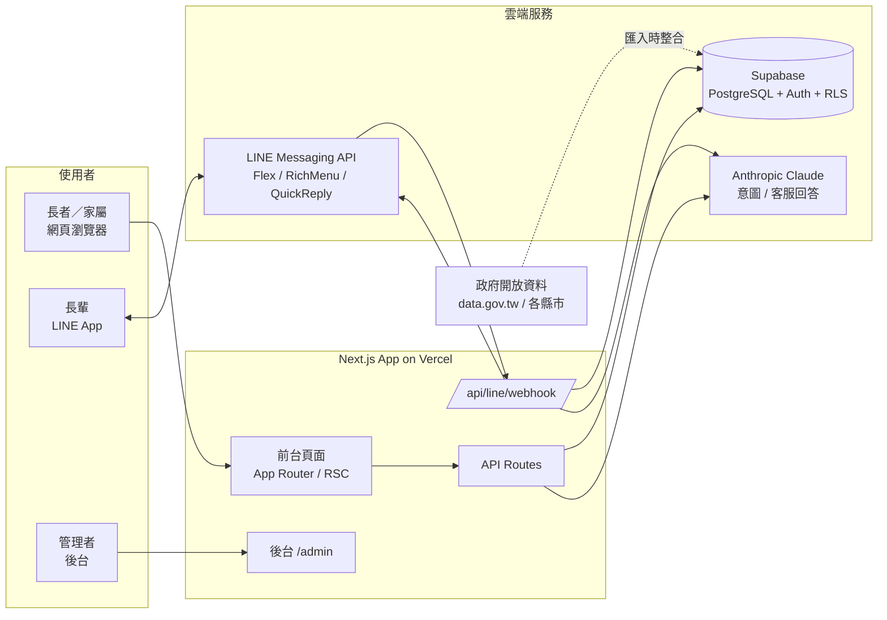
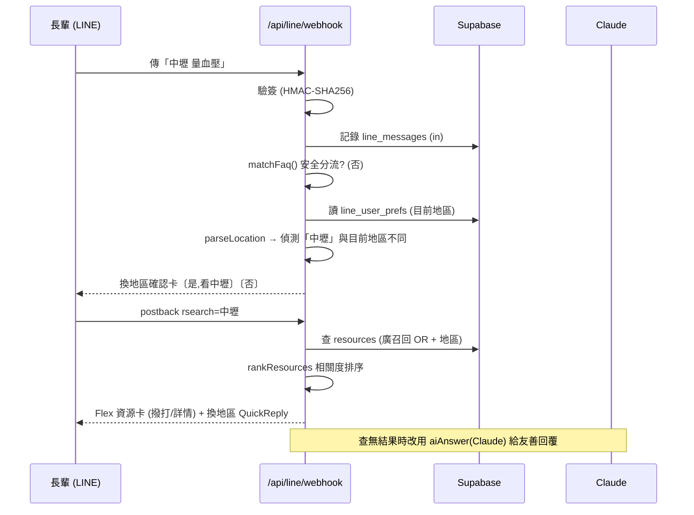

# 幸福好厝邊 ElderLink — 前後端技術文件

> 版本：v1.0　｜　線上：https://elderly-resource-toolkit.vercel.app

---

## 1. 技術棧總覽（Tech Stack）

| 層級 | 技術 | 版本 |
|---|---|---|
| 前端框架 | Next.js（App Router, Turbopack） | 16.2.4 |
| UI 函式庫 | React / React DOM | 19.2.4 |
| 樣式 | Tailwind CSS v4（`@tailwindcss/postcss`）+ 內嵌樣式 | 4 |
| 語言 | TypeScript | 5 |
| 後端 / DB | Supabase（PostgreSQL + Auth + Row Level Security） | supabase-js 2.104、@supabase/ssr 0.10 |
| AI | Anthropic Claude（`@anthropic-ai/sdk`） | 0.91 |
| 對話通路 | LINE Messaging API + LIFF（`@line/liff`） | 2.28 |
| 圖片產出 | html-to-image | 1.11 |
| 佈署 | Vercel（正式站，`--prod`） | — |

> 註：本專案使用 Next.js 16，部分 API／慣例與舊版不同，開發時以 `node_modules/next/dist/docs/` 為準。TypeScript build 錯誤在正式建置時忽略（`typescript.ignoreBuildErrors`）。

---

## 2. 系統架構（Architecture）

### 2.1 系統脈絡圖（System Context）



### 2.2 說明
- **前端**：Next.js App Router，Server Components 為主，需互動處用 Client Components。
- **資料存取**：Server 端用 `createClient`（使用者 session，受 RLS 限制）與 `createAdminClient`（service role，繞過 RLS，用於後台／彙整）。
- **LINE**：`/api/line/webhook` 接收事件、驗簽、查詢、回覆。
- **AI**：意圖分析（網頁搜尋 `/api/search/intent`）、客服回答（LINE 查無結果時的 `aiAnswer`）。
- **開放資料**：匯入時整合進 `resources`，非即時查詢外部 API。

---

## 3. 專案結構（Project Structure）

```
src/
├─ app/
│  ├─ (main)/            # 前台頁面（含 layout）
│  │  ├─ resources/      # 資源分類/詳情
│  │  ├─ search/         # 搜尋（page.tsx + SearchClient.tsx）
│  │  ├─ qa/             # 互助問答
│  │  ├─ activities/     # 活動圖卡
│  │  ├─ scripts/        # 溝通錦囊
│  │  ├─ news/           # 今日新知
│  │  ├─ profile/ favorites/ privacy/ terms/ about/ ...
│  ├─ admin/             # 後台（資源/用戶/聊天/內容回報）
│  ├─ api/               # API Routes（見 §5）
│  └─ page.tsx           # 首頁
├─ components/           # UI 元件（layout / home / resources / admin ...）
├─ lib/
│  ├─ supabase/          # admin.ts / server.ts / client.ts
│  ├─ region/            # locationParse.ts（地區解析核心）
│  ├─ search/            # keywordExpand.ts（口語→細標籤）、rank.ts（相關度排序）
│  ├─ line/              # webhook 工具：flex / menu / store / faq
│  ├─ location/          # regions.ts / cookies.ts
│  └─ resources/ auth/ admin/ ...
├─ config/               # categories 等設定
└─ types/                # domain 型別
supabase/migrations/     # 0001–0015 SQL 遷移
docs/                    # 本文件包
```

---

## 4. 搜尋引擎架構（Search Pipeline）— 核心技術亮點

搜尋是本產品的核心，採「四層管線」，LINE 與網頁**共用同一套核心**，確保行為一致。

```mermaid
flowchart TD
    Q["使用者輸入一句話<br/>(例：中壢 爸爸不舒服想去醫院)"] --> P1

    subgraph L1[第1層 地區解析 locationParse]
      P1[拆出地區 + 關鍵字] --> C{偵測到地區?}
      C -->|群組/縣市+區/同名| P1b[消歧 / 群組展開]
      C -->|與目前地區衝突| P1c[回報需確認]
      C -->|未知地名/無地區| P1d[用預設地區]
    end

    P1b --> L2
    P1c --> ASK[換地區確認卡] -.使用者選是.-> L2
    P1d --> L2

    subgraph L2[第2層 口語→細標籤 keywordExpand]
      E[白話對應 subcategory_id<br/>救護車→民間救護車]
    end

    L2 --> L3

    subgraph L3[第3層 情境FAQ faq (LINE)]
      F{安全/情境命中?}
      F -->|急症/輕生/詐騙 p≥8| FR[直接回專線 119/1925/165]
    end

    F -->|否| L4

    subgraph L4[第4層 相關度排序 rank]
      R[廣召回 OR 查詢 → 計分排序<br/>細標籤>名稱>標籤>摘要<br/>再 全國→縣市→區]
    end

    R --> OUT[回傳結果卡 / Flex]
    FR --> OUT
```


### 第 1 層：地區解析 `lib/region/locationParse.ts`
- 從一句話拆出「地區 + 關鍵字」，詞序無關。
- 支援：縣市＋行政區（台北松山→台北市+松山區）、簡稱與舊地名（復興鄉→桃園市復興區）、
  區域群組（花東／南部／離島／六都／雙北…展開為多縣市）、同名地區消歧（大安、信義、中正…）、
  偏鄉需先問縣市、非正式地名（民生社區等）視為「不確定地區」並略過。
- `regionConflict()`：**只有偵測到地區且與目前選擇衝突時**才回報需提示；相同或未設定則直接搜。

### 第 2 層：口語→細標籤對照 `lib/search/keywordExpand.ts`
- 使用者打白話（救護車、送便當、手機不會用），對應到正確的 subcategory（民間救護車、送餐服務、3C 教學）。
- 涵蓋全部 67 個細標籤的常見講法，命中即精準取得 `subcategory_id`。

### 第 3 層：情境式 FAQ `lib/line/faq.ts`（LINE 端）
- 以優先權（`p`）比對；**安全類永遠優先**（急症→119、中風→FAST、輕生→1925、受虐→113、詐騙→165）。
- `matchFaq()` 回傳 `{a, route, prio}`；高優先（p≥8）在流程最前面直接回，不被地區邏輯蓋掉。

### 第 4 層：相關度排序 `lib/search/rank.ts`
- 計分：細標籤精準命中（+120）＞ 名稱命中（+40/詞）＞ 標籤（+25）＞ 摘要（+12）。
- 依分數分桶排序 → 同桶內套「全國 → 縣市 → 行政區」→ 再比收藏＋讚數。
- 計分僅用「強關鍵字」（真實詞＋口語同義詞），不用 bigram 雜訊，排序更乾淨。

> DB 查詢用「廣召回」（OR：子分類 id + 名稱/摘要 ilike + `extra_subcats` 陣列重疊），排序用「精準計分」，兼顧召回與精度。

---

## 5. API 介面（API Routes）

| 路徑 | 方法 | 說明 |
|---|---|---|
| `/api/line/webhook` | POST | LINE 事件入口：驗簽、路由（訊息／postback／follow）、查詢與回覆 |
| `/api/search/intent` | POST | 以 Claude 解析查詢意圖（分類／子分類／關鍵字），失敗回退關鍵字法 |
| `/api/resources` | GET | 資源查詢 API（含子分類、`extra_subcats`、bookmark_count） |
| `/api/location/regions` | GET | 縣市→行政區清單 |
| `/api/location/set` | POST | 設定使用者地區（cookie） |
| `/api/location/detect` | POST | 依經緯度找最近地區並設定 |
| `/api/cron/fetch-news` | GET | 今日新知定時爬取 |
| `/api/admin/resources/import`｜`export`｜`export-csv` | — | 後台資源匯入/匯出 |
| `/api/admin/ai-clean`｜`fetch-news`｜`seed-resources` | — | 後台輔助工具 |

### LINE Webhook 事件處理
- **message(text)**：先記錄→安全 FAQ 直接回→地區解析→（衝突則）換地區確認卡→查詢→相關度排序→Flex 回覆（附地區 Quick Reply）。
- **postback**：分類/子分類選單、資源詳情、換地區（rchg/rc/rset）、確認搜尋（rsearch/rgroup）、設定地區（rok）等。
- **follow**：歡迎訊息 + 設定地區流程；綁定新手 Rich Menu。



---

## 6. 認證與授權（Auth & Security）

- **登入方式**：LINE、Google、手機驗證碼（Supabase Auth），不保存密碼。
- **帳號連結**：`account_links`（provider, provider_key → user_id），讓 LINE 使用者與網站帳號互通。
- **RLS**：資料表啟用 Row Level Security；使用者 session 走 `createClient`；後台／彙整走 `createAdminClient`（service role）。
- **LINE 驗簽**：以 `LINE_CHANNEL_SECRET` HMAC-SHA256 驗證 `x-line-signature`，失敗回 401。
- **環境變數**：`NEXT_PUBLIC_SUPABASE_URL`、`SUPABASE_SERVICE_ROLE_KEY`、`LINE_CHANNEL_ACCESS_TOKEN`、`LINE_CHANNEL_SECRET`、`ANTHROPIC_API_KEY`、`NEXT_PUBLIC_SITE_URL`。

---

## 7. 資料流：政府開放資料整合

1. 由 data.gov.tw／各縣市開放資料取得原始檔（CSV/JSON，含 Big5 編碼處理）。
2. 匯入時正規化：對應到 `subcategory_id`、`region_id`（縣市/行政區）、`scope`（national/local）、標註 `source_org`。
3. 去重、多標籤（`extra_subcats`）、跨標籤合併。
4. 現況 18,020 筆，八大分類。詳見文件 04。

---

## 8. 佈署與環境（Deployment）

- **正式站**：Vercel，`npx vercel --prod`；正式網域別名 `elderly-resource-toolkit.vercel.app`。
- **資料庫遷移**：`supabase/migrations/` 0001–0015，DDL 由維運者於 Supabase 執行。
- **建置**：Next.js 16 + Turbopack；`typescript.ignoreBuildErrors: true`（型別錯誤不擋建置，但仍維護型別品質）。

---

## 9. 品質與後續（Quality & Roadmap）

- 已以真實資料表對搜尋核心做多情境驗證（地區解析、口語對照、相關度排序、FAQ 分流）。
- 規劃：搜尋失準回報看板、LLM 語意兜底、排除規則 + 自動化測試、開放資料自動更新。
