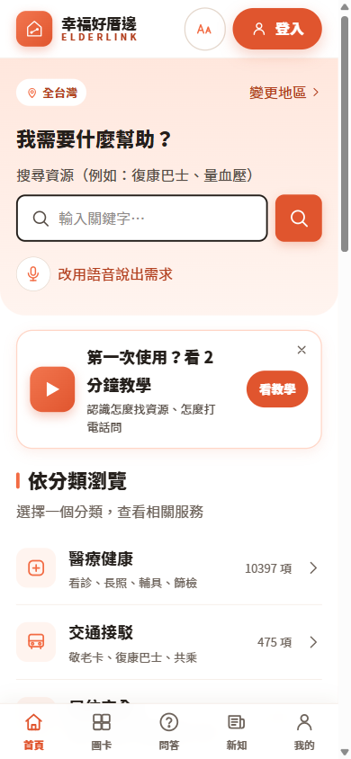
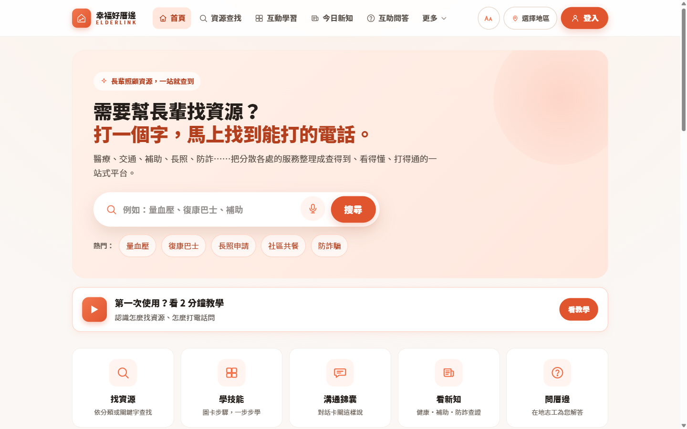
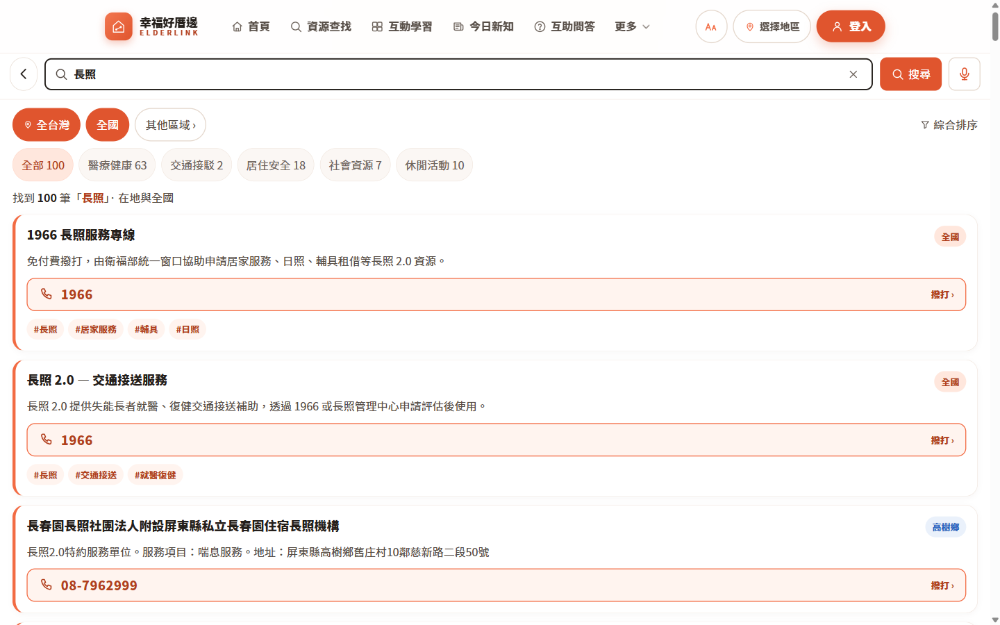
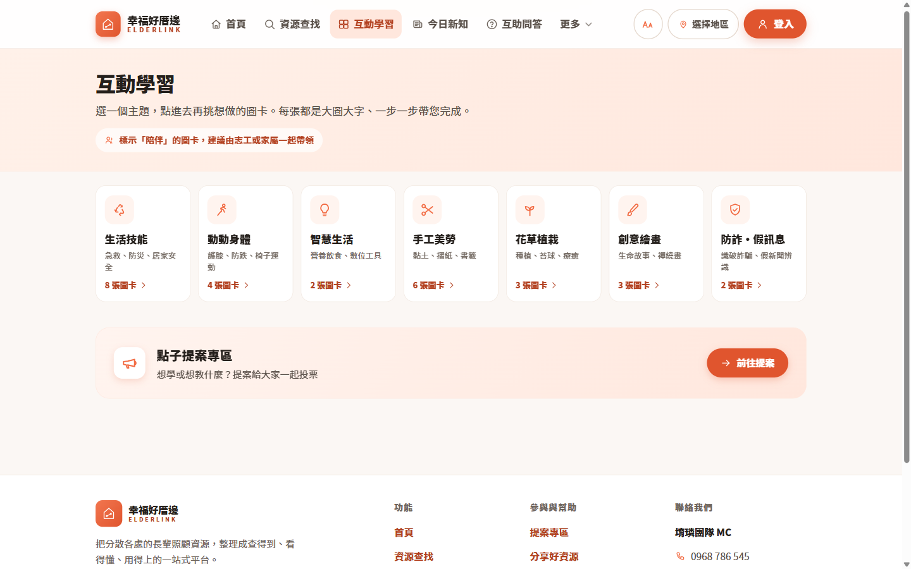
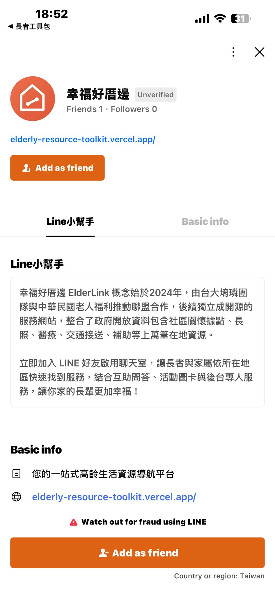
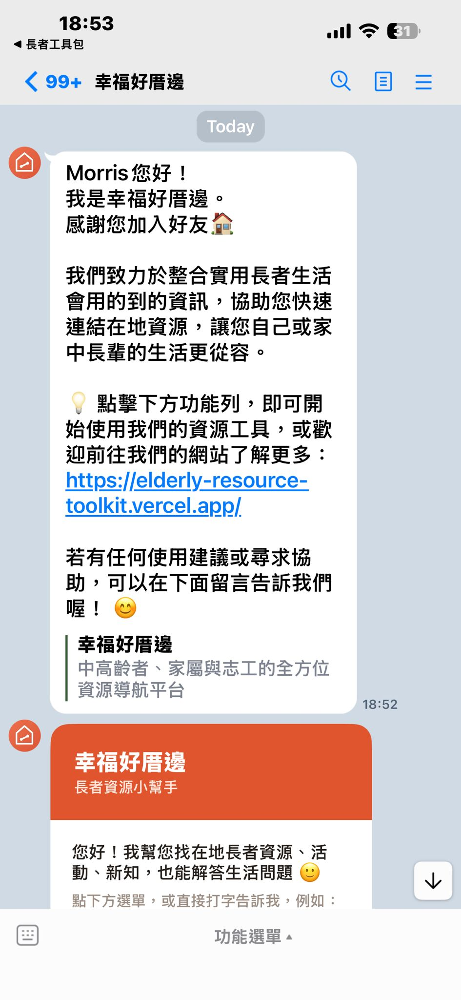

<!-- _class: cover -->
# 幸福好厝邊 ElderLink

## 長輩身邊的好厝邊

網頁：elderly-resource-toolkit.vercel.app
LINE：加好友搜尋 **@796rwlaq**

---

<!-- _class: section -->
# 家裡有長輩，或您正邁入熟齡？

找資源、找陪伴，都從這裡開始。

---

# 這個平台能幫您什麼？

- 🔍 **找資源**：長照、醫療、交通、補助…打一個字就找到能打的電話
- 📍 **在地化**：自動幫您找「所在縣市／行政區」的服務
- 💬 **問厝邊**：互助問答，在地志工幫您解答
- 🎴 **學技能／看新知**：活動圖卡、防詐提醒
- 🤝 **用 LINE 就能用**：不用下載 App、不用註冊

---

# 兩種使用方式

| 網頁版 | LINE 官方帳號 |
|---|---|
| 手機、電腦都能開 | 加好友就能用 |
| 適合子女幫忙查 | **最適合長輩** |
| 完整功能 | 打字或點選單即可 |

> 建議：長輩用 **LINE**，家屬用 **網頁**，一起幫忙

---

# 網頁首頁：打一個字就開始

大搜尋框 + 熱門詞 + 六大功能，一眼看懂。

---

# 網頁操作（1）：設定您的地區

1. 打開網站
2. 上方點「**選擇地區／變更地區**」
3. 選您的縣市 → 行政區
4. 之後找資源會自動優先顯示「您這裡」的服務

📍 徽章：綠色「你的地區」、橘色「全國」、藍色「在地」

---

# 網頁操作（2）：搜尋資源

1. 首頁大搜尋框，直接打白話
   （量血壓、假牙補助、爸爸不舒服想去醫院）
2. 也可點 🎤 **麥克風**，直接「說」出需求
3. 由上到下＝**最相關的在前面**
4. 點卡片上的**大電話按鈕**直接撥打

---

# 網頁操作（3）：更多貼心功能

- ⭐ **收藏**：常用資源存起來，手機電腦同步
- 📤 **分享給家人**：把資源傳給子女或長輩
- ⚠️ **回報資料有誤**：電話變了就回報，我們會更新
- 👍 **說讚**：好用的資源按讚，讓更多人看到

---

# 學技能・問厝邊

- 🎴 **活動圖卡**：手作、運動、園藝、懷舊，步驟式教學
- 💬 **互助問答**：把問題丟出來，在地志工與厝邊互相解答
- 📰 **今日新知**：高齡新知與防詐提醒

---

# 手機版：App 般的操作

底部固定五格：首頁／圖卡／問答／新知／我的
字大、按鈕大、好點選——為長輩設計。

---

# LINE 操作（1）：加好友

1. 打開 LINE → 搜尋 **@796rwlaq**（含小老鼠）
   或掃描官方帳號 QR Code
2. 按「**加入好友（Add as friend）**」
3. 第一次會請您**選所在地區**（選一次就記住）

---

# LINE 操作（2）：小幫手先跟您打招呼

- 顯示歡迎訊息與網站連結
- 下方「**功能選單**」即可開始使用
- 也能直接打字，例如「中壢 長照」

---

# LINE 操作（3）：怎麼問

直接打字，最推薦「**縣市 + 需求**」：

- 「中壢 長照」
- 「台南 送餐」
- 「量血壓」（不含地區時，用您設定的地區）

系統會回**資源卡片**，點卡片按鈕就能撥打電話或看詳情。

---

# LINE 操作（4）：換地區

- 想查別的地方？直接打「**台南 長照**」
- 若和您設定的地區不同，會先問：
  〔是，看台南〕〔否，維持原本〕
- 底部隨時有「**換地區**」按鈕

---

# LINE 操作（5）：緊急與安心

打字描述狀況，系統會**先給安全提醒**：

- 「爸爸不舒服想去醫院」→ 先分流（119／接送／找院所）
- 胸痛、昏倒、中風徵兆 → **立刻 119**
- 「孫子打來要錢」→ 詐騙提醒 **165**
- 心情低落 → 安心專線 **1925**

---

# 常用專線（隨手記）

| 需求 | 專線 |
|---|---|
| 緊急救護／報案 | 119 / 110 |
| 長照諮詢 | 1966 |
| 福利諮詢 | 1957 |
| 反詐騙 | 165 |
| 安心專線 | 1925 |
| 老人保護 | 113 |

---

<!-- _class: cover -->
# 讓長輩找得到資源，也找得到人

網頁：**elderly-resource-toolkit.vercel.app**
LINE：加好友 **@796rwlaq**

有任何問題或建議，歡迎來信
**itchiang2025@gmail.com**

（本平台 v1，上線測試中，感謝您的回饋 🙏）
